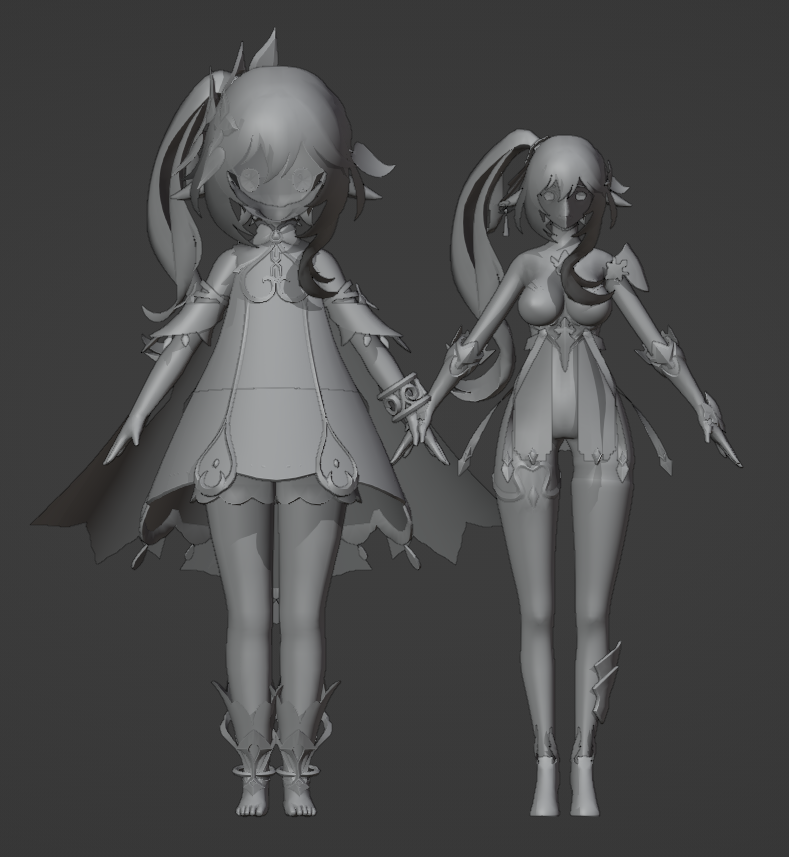
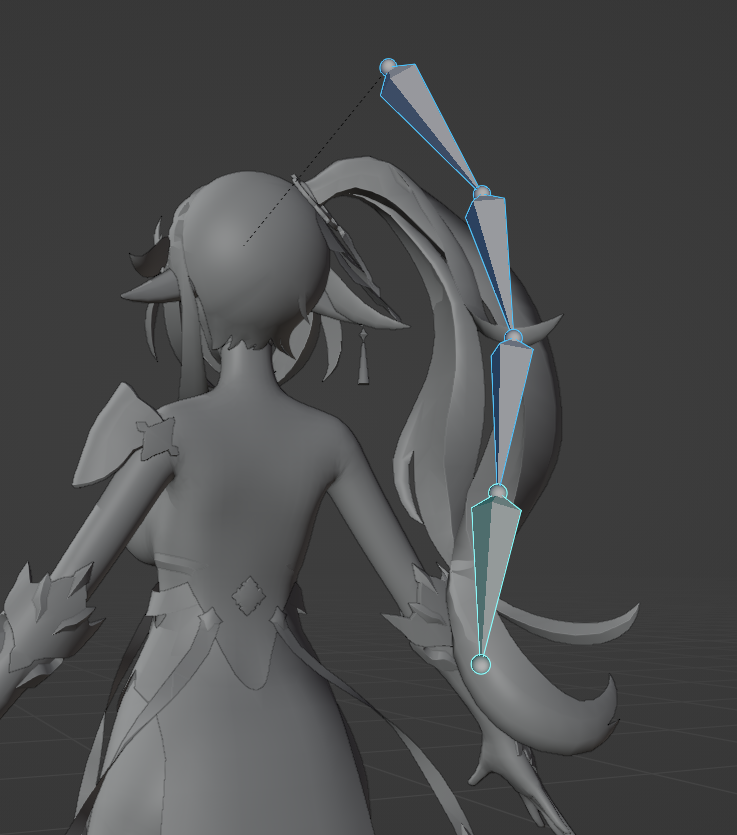
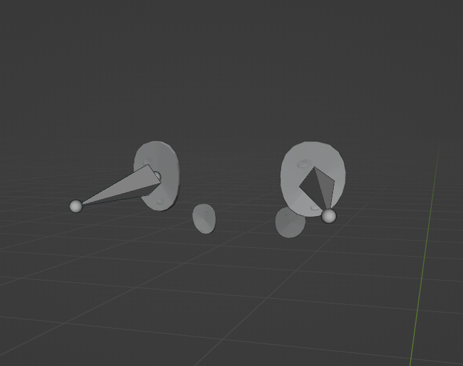

# Resize and offset character guide

This is a guide for the tool that allows you to offset characters position and change their size in your mods.

- [Requirements](#requirements)
- [Restrictions](#restrictions)
- [Blender setup](#blender-setup)
    - [Preparations](#preparations)
    - [Export](#export)
- [Scripts](#scripts)
    - [Resize](#resize)
    - [Offset](#offset)
- [Modifying face](#modifying-face)
    - [Hiding face](#hiding-face)
    - [Replacing face](#replace-face)
    - [Resizing face](#resizing-face)
- [Quick summary](#quick-summary)
- [Tips](#tips)
- [Known Issues](#known-issues)
- [INI samples](#ini-samples)

## Requirements

- A fully working character mod
- [Offset-Scale Changer](https://github.com/leotorrez/LeoTools/releases/tag/offsetchanger)  
- [Multiply weight Python script](https://github.com/leotorrez/LeoTools/blob/main/multiplyweight.py)

Before we start, make a backup or two!
If anything goes wrong, you can easily revert all the changes.

I also recommend that you read the [restrictions](#restrictions) section first.

## Restrictions

- ***VERY IMPORTANT:*** If you want to age a character up or down, you need to change their proportions (head-to-body size ratio), unless you want to create a giant kid or a tiny adult. You will quickly notice that the face doesn't line up with the head. Adjusting it would require you to use different scaling values for the body and the face (e.g., 1.44 for the body and 0.9 for the face). You can offset both the face and the body if you don't resize them, but the math stops working properly if you do. Most of the time, you simply cannot use the same offset values for the face. Moreover, different scaling values result in a difference between the relative positions of the face and body pivot points compared to their default positions. Therefore, you might need to model a fake face for your character and place it in their body mesh. The downside is that they are going to lose their facial animations.
- Resized characters use their original animations which vary for different body types/heights. For example, adult Nahida is still gonna run like a kid.
- The game camera is going to remain where it was originally. For example, if you size a character up, their head is gonna be above the focal point of the camera. Alternatively, if you scale a character down, they are gonna be below the focal point of the camera. The same restriction applies to cutscenes.
- Even though your character looks bigger/smaller, their skeleton remains the same. So your character's attacks are not going to reach further than they do originally. The same applies to climbing, swimming, etc. In other words, it does not alter gameplay in any way; it is purely a cosmetic change.

## Blender setup

For the purposes of this guide, we are going to go through the process of creating a mod for Nahida that drastically changes her proportions and requires her to have a fake face model.

### Preparations

There are a few key points to prepare your model for resizing.

Scale your character model as close as possible to the original model.
This is an example of adult Nahida body next to her default body.

  
This is needed for proper weights transfer (if you haven't done this up to this point), and for proper deformations as well.
You can use a character armature to check deformations in blender.  

Here is an example of misalignement of the sized down hair and the character's armature.
  

In this case the misalignement is not big enough to cause a severe distortion in animations, in other words, it works for this model, but your mileage may vary.

The eyes, on the other hand, are very sensitive to even the slightest difference to their position.

  
The bigger eyes are the default ones, and the smaller eyes are the modded ones.  

Something like shown on this picture is way too much difference in the eyes position, they are gonna move weird.  
**It is better to assign them to the head vertex group.**

When you are done with all this, you can export your model.

### Export

Export your model just like any other mod. No additional steps or instructions here. Scaling and offset are dealt with outside of blender.

## Scripts
### Resize

1. Copy multiplyweight.py script in the desired character mod folder.
2. Run it.
3. Enter the value you want to multiply the character's size by.
    - 1 is the original size.
    - Values bigger than 1 will upscale the character (e.g. 1.2)
    - Values lesser than 1 will downscale the character (e.g. 0.8)
    - The script uses the current character size as a reference point. If you upscaled the character twice (you used value 2 the previous time you ran the script) and want to revert the change, you are gonna have to run the script again and use 0.5 as a resize value. This will size character back down to their original size (2 * 0.5 = 1).  
    Alternatively, you can restore your CharacterBlend.buf backup.
    
You can run the game now - you will see that your character has different size.
But you will quickly notice one issue.  
If you upscaled the character, their feet or entire legs are gonna be in the ground.
And if you downscaled the character, they are gonna float in the air

To fix this issue, we need to offset the character.

### Offset

1. Download [Offset Scale Changer](#requirements)
2. Unpack it and copy ShaderFixes and Mods folders into your main 3dmigoto folder.
3. Open your mod INI file
4. Add **offset** variable to the [Constants] section:
``` INI
[Constants]
global $offset = *offset_value*
...
```
5. Calculate the offset when the character is on screen by adding `$\global\offset\offset = $offset` line in your [TextureOverrideCharacterPosition] section:
``` INI
...
[TextureOverrideCharacterPosition]
;initiall overrides

$\global\offset\offset = $offset
...
```
6. Apply the offset to every character part they have (head, body, dress, extra).  
To do that, you need to add `run = CommandList\global\offset\Offset` line to their respective sections (this can technically be applied on gliders, weapons and accessories but those are not supported by default so expect issues or wait for an update on the script):
``` INI
...
[TextureOverrideCharacterPart]
;initial overrides

run = CommandList\global\offset\Offset
...
```

## Modifying face

Modifying faces in any way creates all sorts of different issues (see [known issues](#known-issues) for more details), but it is still doable and, in our case, has to be done.

It is very important that **all the modifications to the face parts are done by their IB hash**(there is 3 IBs for face. Eyes, mouth and eyebrows), NOT VB! (skipping VB will cause random issues)

### Hiding face

To hide the original face, you need to prevent all the face parts from rendering. You can do that by placing the line `handling = skip` in their overrides.

It is recommended that you use the `if $active == 1` check because we don't want this to take effect when our character is not on screen and another character uses the same face parts.
``` INI
[Constants]
global $active = 0

[Present]
post $active = 0

[TextureOverridePosition]
hash = 
$active = 1

[TextureOverrideFace1]
hash = *Face Part IB Hash*
if $active == 1
    handling = skip
endif
...
```
The outlines of the face might end up floating midair if you have other shaders that interact with it. Like the outline and reflection fix for 3.0+ characters. In the case of this one you can fix it by adding an extra line to each of the 3 face IBs.  
``` INI
[TextureOverrideFace1]
hash = *Face Part IB Hash*
if $active == 1
    $\global\ORFix\active = 0
    handling = skip
endif
```

### Replacing face
We won't elaborate much on this section on the exact steps because there's several methos that could work even better than the one I use.

However if you intend to hide the face and add your own into the body mesh, theres a few things to keep in mind. First of all you will lose in game facial animations. You can account for it with a universal rest pose or some animated mod that deals with it.

The body shading is too complex for the style the face has, hence you need to get simplified normals on the face. Google the term for more info.

Lastly. The eyes in genshin are actually hollow because of how their shaders are set up- HOWEVER we don't have the proper shading in body mesh. So you will have to think a way around it. I personally haven't found any good method so good luck on this and contact me if you find a decent method.
### Resizing face

You don't need to resize the face if you hide it. But in case you don't - resizing is an option, although not recommended.

To resize the face, you need:
- `$faceScale` value in your [Constants] section
- `$global\offset\faceScale = $faceScale` line in your [Position] section
- `run = CommandList\global\offset\OffsetFace` line in each part of the face.  

It is recommended that you use the `if $active == 1` check because we don't want this to take effect when our character is not on screen and another character uses the same face parts.
``` INI
[Constants]
global $active = 0
$faceScale = *face_scale_value* ;the number you want to scale the face by

[Present]
post $active = 0

[TextureOverrideCharacterPosition]
;initial overrides

$active = 1
$global\offset\faceScale = $faceScale

[TextureOverrideCharacterFaceIB1]
; hash =

if $active == 1
    run = CommandList\global\offset\OffsetFace
endif
```

### Offsetting face

You don't need to offset the face if you hide it. But in case you don't - it is possible. Works perfectly if nothing was resized.

To offset the face, you need:
- `$faceOffset` variable in your [Constants] section (or you can use the `$offset` variable you already have for the body)
- `run = CommandList\global\offset\OffsetFace` line in each part of the face.  

It is recommended that you use the `if $active == 1` check because we don't want this to take effect when our character is not on screen and another character uses the same face parts.
``` INI
[Constants]
$offset = *face_offset_value*

[TextureOverrideCharacterPosition]
;initial overrides

$active = 1
$\global\offset\faceOffset = $offset

[TextureOverrideCharacterFaceIB1]
; hash =
if $active == 1
    run = CommandList\global\offset\OffsetFace
endif
...
```

## Quick Summary

- Get your blender model ready.
- Export it as any other mod.
- Run **multiplybyweight.py** in the character mod folder you just created. It is gonna modify your CharacterBlend.buf file.
- Add [offset](#offset) for the character's body.
- [Hide](#hiding-face) (recommended) or [offset](#offsetting-face) the face. **Use their IB Hash for it!**

## Tips

- A good advice would be to download and import a character's skeleton/armature into blender for reference.
- Try to keep the position of body parts of your model as close as possible to the character's default body parts. A skeleton/armature might help you to check the deformations.
For example, if you decide to age character up, you will have to make their head smaller. And that implies making their hair smaller as well. Make sure not to overdo it, because the smaller the hair is, the more distance there is between the hair vertecies and the armature, and that means more distortion during animations.
- You can remove offset when the character is swimming so that they don't do it above or below the water. See [tracking](https://github.com/whocares8128/GI-Status-Tracker).
- If you use a fake face for the character, it is recommended that you use one of many normals manipulation tricks to force the game to draw anime-ish shadow on the face.

## Known issues

- F6 is not gonna work anymore. All the modded characters are gonna look like spiky abominations in the F6 'mods off' mode, no matter if their size was changed or not.  

- We have to modify the face one way or another, either hide it or resize and offset it. The problem is that genshin charactres share their face parts between different characters. So when there are other characters on screen with a character that uses this tool, they can randomly have their face parts hidden/resized/offset. You are usually gonna see this in party screen, in the teapot and in coop.  
**Solution**: There is no solution for this.

- You are supposed to use IB hash for manipulations on the face parts, otherwise your game is gonna behave weird - it can freeze, UI elements can pop in and out of existence, you can see weird flashy artifacs here and there, etc.  
**Solution**: don't use VB hashes for the face parts. Use their IB hashes instead.

## INI samples

### Offsetting Shenhe's body and face positions

An example of face offset in Leo's Shenhe mod.

You can place all the offset calculations in their own CommandList and call it from the [CharacterPosition] override section.

``` INI
[Constants]
global $active = 0
global $offset=-0.45

[Present]
post $active = 0

[CommandListOffset]
$\global\offset\offset = $offset
$\global\offset\faceOffset = $offset

[TextureOverrideShenhePosition]
hash = e44b58b5
vb0 = ResourceShenhePosition
$active = 1
run = CommandListOffset

[TextureOverrideShenheFaceIB1]
hash = 7b61f273
if $active == 1
    run = CommandList\global\offset\OffsetFace
endif

[TextureOverrideShenheFaceIB2]
hash = dc710a44
if $active == 1
    run = CommandList\global\offset\OffsetFace
endif
[TextureOverrideShenheFaceIB3]
hash = f931161a
if $active == 1
    run = CommandList\global\offset\OffsetFace
endif

[TextureOverrideShenheBlend]
hash = 541cf273
vb1 = ResourceShenheBlend
handling = skip
draw = 28844,0 

[TextureOverrideShenheTexcoord]
hash = 86c4f5ec
vb1 = ResourceShenheTexcoord

[TextureOverrideShenheVertexLimitRaise]
hash = fde191d7

[TextureOverrideShenheIB]
hash = 0b7d4e4d
handling = skip
drawindexed = auto

[TextureOverrideShenheHead]
hash = 0b7d4e4d
match_first_index = 0
ib = ResourceShenheHeadIB
ps-t0 = ResourceShenheHeadDiffuse
ps-t1 = ResourceShenheHeadLightMap
run = CommandList\global\offset\Offset

[TextureOverrideShenheBody]
hash = 0b7d4e4d
match_first_index = 14385
ib = ResourceShenheBodyIB
ps-t0 = ResourceShenheBodyDiffuse
ps-t1 = ResourceShenheBodyLightMap
run = CommandList\global\offset\Offset

[TextureOverrideShenheDress]
hash = 0b7d4e4d
match_first_index = 48753
ib = ResourceShenheDressIB
ps-t0 = ResourceShenheDressDiffuse
ps-t1 = ResourceShenheDressLightMap
run = CommandList\global\offset\Offset

; Resources -------------------------
```

### Hiding Nahida's face

You can place all the face modifications in their own ini file if you want. Remember to set the `match_priority` value to get rid of the 'duplicate hash override' error.

This is a separate INI file to hide Nahida's face in Leo's 'Rukkhadevata over Nahida' mod.

``` INI
[Constants]
global $active = 0
[Present]
post $active = 0

[TextureOverridePosition]
hash = 37ef15ec
$active = 1
match_priority = 1 ;Needed to eliminate the conflict with the main ini file because of the same hash override in there
[TextureOverrideFace1] 
hash = 46343c52
if $active == 1
    $\global\ORFix\active = 0
    handling = skip
endif

[TextureOverrideFace2]
hash = 17b3e07a
if $active == 1
    $\global\ORFix\active = 0
    handling = skip
endif

[TextureOverrideFace3]
hash = 7fc58760
if $active == 1
    $\global\ORFix\active = 0
    handling = skip
endif
```

You can remove `$\global\ORFix\active = 0` if it causes issues.